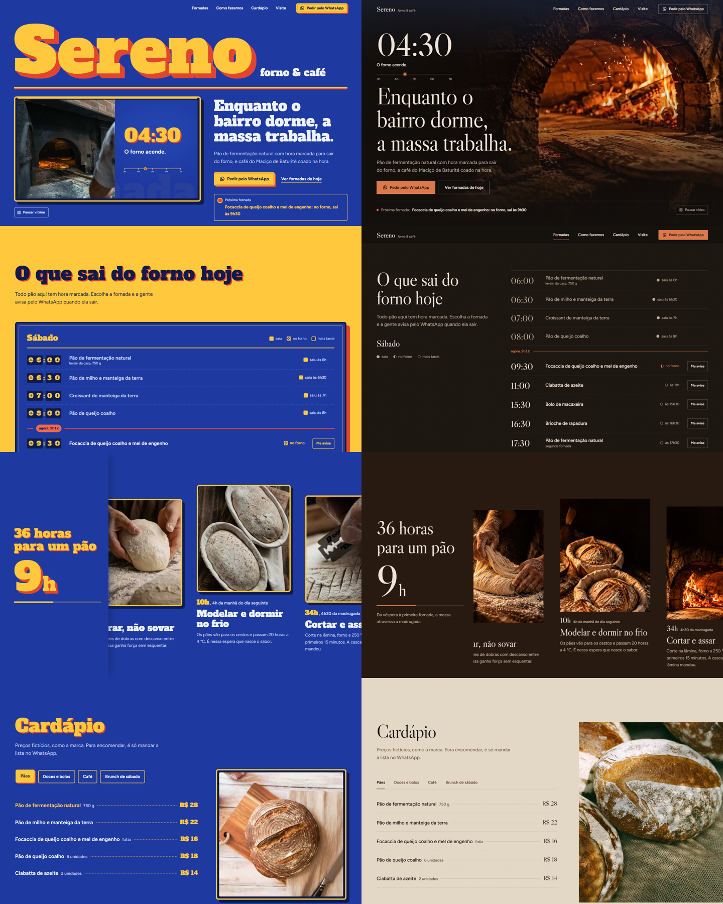

# Sereno · Forno & Café

**Landing page conceitual para uma padaria de fermentação natural no interior do Ceará.**
Direção de arte, motion design e desenvolvimento front-end.

🔗 **Ver ao vivo:** https://sereno-forno-cafe.vercel.app

> Projeto de portfólio. A Sereno é uma marca fictícia: nome, endereço, preços, horários e depoimentos foram criados para o case.



---

## A ideia

Numa padaria de verdade, o pão fica pronto antes de o bairro acordar. Por isso a página não conta só o que a Sereno vende: ela conta **a madrugada de quem faz o pão**.

O site abre às 3h40, com a massa descansando e o forno a lenha acendendo às 4h30. Conforme a pessoa rola, as 36 horas de fermentação passam e o fundo da página **amanhece**: sai do café-preto, passa pela aurora e chega à luz do dia, até a padaria abrir as portas.

O objetivo da página é um só: levar a pessoa a pedir pelo WhatsApp ou a reservar o brunch.

## Direção de arte: "Madrugada"

Antes de desenhar, estudei 15 marcas de padaria e café de alto nível, como GAIL's, Poilâne, Tartine e Hart Bageri. A partir delas montei três direções visuais diferentes e escolhi a que melhor traduzia a ideia da madrugada.

| | |
|---|---|
| **Paleta** | café-preto `#14100D`, papel `#EDE4D6`, farinha `#B9A893` e brasa `#D9774A` como único acento |
| **Tipografia** | Libre Caslon Display nos títulos, horários e preços; Figtree no texto |
| **Fotografia** | clave baixa, uma luz quente lateral como a da boca do forno, farinha no ar |
| **Interface** | contenção: fotos grandes sem moldura, botões finos, muito respiro |

As imagens do hero, do processo, do Nordeste e da Visite foram geradas por IA (ChatGPT e Google Flow/Veo) a partir de um guia de estilo único, para que todas parecessem do mesmo ensaio fotográfico. O site avisa isso no rodapé.

## O que tem na página

- **Hero com vídeo:** um loop montado em HyperFrames, em 16:9 no desktop e 9:16 no celular. O relógio da madrugada acompanha cada cena do vídeo.
- **Quadro de fornadas ao vivo:** mostra o que já saiu do forno, o que está assando e o que vem depois, no horário real do Ceará. O botão "Me avise" abre o WhatsApp com a mensagem pronta.
- **36 horas para um pão:** o processo em 5 etapas, numa rolagem horizontal com contador de horas, enquanto o fundo amanhece.
- **Do Nordeste para o forno:** os ingredientes locais, com contador animado e vapor do café.
- **Cardápio:** abas acessíveis pelo teclado, com a foto do item trocando junto.
- **Visite:** status "aberto agora" calculado pelo horário e os horários do dia destacados.

## Motion design

O movimento acompanha a história: luz de forno, farinha no ar e o dia nascendo. Na página há, entre outros:
- títulos que entram linha a linha;
- relógio com dígitos rolando;
- fotos que se abrem como uma janela;
- rolagem horizontal fixa no processo;
- marquee que reage à velocidade da rolagem;
- placa da padaria que balança ao aparecer;
- botões que seguem o cursor.

Quem prefere menos movimento (`prefers-reduced-motion`) vê uma versão calma e completa: sem rolagem suave e sem pino, com o vídeo parado e um botão para tocar.

## Qualidade

| Lighthouse | Performance | Acessibilidade | Boas práticas | SEO |
|---|---|---|---|---|
| Celular | 98 | 100 | 100 | 100 |
| Desktop | 100 | 100 | 100 | 100 |

Imagens em AVIF e WebP em 5 tamanhos e fontes servidas pelo próprio site. O CLS é zero e o vídeo sempre tem botão de pausar.

## Tecnologias

HTML, CSS e JavaScript · [GSAP](https://gsap.com) (ScrollTrigger e SplitText) · [Lenis](https://lenis.darkroom.engineering) · [HyperFrames](https://github.com/heygen-com/hyperframes) para o vídeo · [Vite](https://vite.dev) · imagens por IA (ChatGPT, Google Flow/Veo) · hospedagem na Vercel.

## Rodar localmente

```bash
npm install
npm run dev
```

O quadro de fornadas aceita um horário fixo para teste, por exemplo `?hora=09:12&dia=sab`.

## Créditos

As fotos, fontes e bibliotecas usadas estão em [CREDITOS.md](CREDITOS.md).
